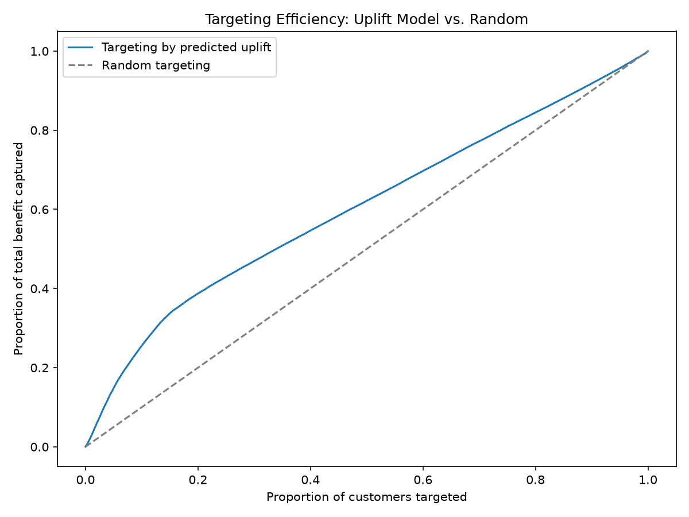

# Predicting Second Purchases & Targeting Retention Discounts

**A customer analytics project using real e-commerce data — built around one honest finding: predicting *who will return* is hard, but predicting *who responds to an incentive* is not.**

## The Problem
Most e-commerce customers only buy once. Blasting everyone with a retention discount wastes budget on customers who'd return anyway — or wouldn't return regardless. This project builds a system to identify which first-time buyers are actually **persuadable**.

## Key Result
Targeting the top 20% of customers by predicted uplift captures **38.8% of total campaign benefit** — nearly 2x more efficient than random discounting, at a fraction of the cost.



## What's Inside
| Step | What it covers |
|---|---|
| Data pipeline | 9 raw tables → clean customer-level features via SQL (DuckDB) |
| EDA | Diagnosed a common framing mistake (churn vs. second-purchase prediction) before modeling |
| Baseline models | Logistic Regression + XGBoost — honestly weak (~0.57 ROC-AUC), and I explain why |
| Uplift modeling | T-learner identifies who benefits from a discount — Qini coefficient of 33.9 |
| NLP experiment | Tested review sentiment as a feature — negative result, reported honestly |
| Dashboard | Interactive Streamlit app to explore targeting tradeoffs |

## Try It
```bash
git clone <your-repo-url>
cd retention-uplift-project
pip install -r requirements.txt
streamlit run app/dashboard.py
```

## Full Methodology
See [`docs/METHODOLOGY.md`](docs/METHODOLOGY.md) for the complete write-up — data sourcing, every modeling decision, all results, and the reasoning behind each pivot.

## Tech Stack
Python · DuckDB (SQL) · scikit-learn · XGBoost · Transformers (BERT) · Streamlit · Plotly

## Data Source
[Olist Brazilian E-Commerce Dataset](https://www.kaggle.com/datasets/olistbr/brazilian-ecommerce) — real, anonymized orders (2016–2018).
